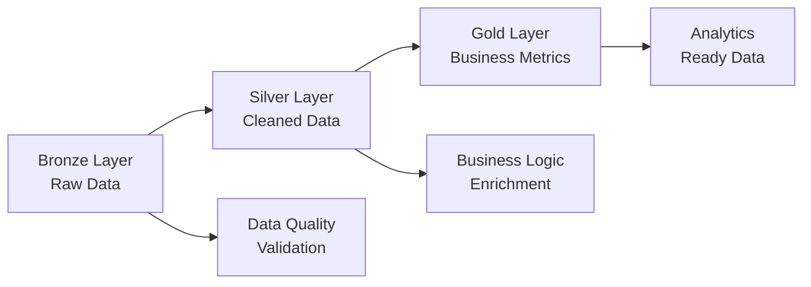

# Databricks Lake Flow CTAS Examples - Documentation Overview

This document provides a comprehensive overview of the documentation added to the Databricks Lake Flow CTAS examples, making it easier to understand and implement advanced data engineering patterns.

## Documentation Structure

### 1. File Header & Overview

- **Purpose and scope** of the Lake Flow examples
- **Prerequisites** and setup requirements  
- **Key concepts** demonstrated throughout the file
- **Lake Flow benefits** and capabilities overview

### 2. Detailed Section Documentation

Each CTAS example now includes comprehensive documentation:

#### Technical Details

- **CONCEPT**: What the example demonstrates
- **KEY FEATURES**: Specific capabilities showcased
- **PERFORMANCE OPTIMIZATIONS**: Why certain settings are used
- **USE CASE**: Real-world applications

#### Code Comments

- **Line-by-line explanations** for complex operations
- **Function explanations** (window functions, aggregations, etc.)
- **Business logic reasoning** behind calculations
- **Technical parameter meanings**

### 3. Advanced Feature Explanations

#### Architecture Patterns

- **Medallion Architecture** (Bronze → Silver → Gold)
- **Multi-hop data processing** benefits
- **Data quality progression** through layers

#### Performance Features

- **Liquid Clustering** vs traditional partitioning
- **Auto-optimization** settings and benefits
- **Streaming tables** and change data capture
- **Statistical functions** and their use cases

### 4. Lake Flow Specific Features

- **Data Quality Expectations** with constraint examples
- **Change Data Feed** (CDC) capabilities
- **Time Travel** query patterns
- **Vacuum and Optimize** operations

### 5. Performance Guide

- **7 optimization strategies** with detailed explanations
- **Query optimization patterns**
- **Monitoring and troubleshooting** guidance
- **Best practices** for different scenarios

### 6. Complete Testing & Execution Guide

#### 5-phase testing workflow:

1. **Data Generation Phase**
2. **CTAS Execution Phase**
3. **Validation Phase**
4. **Feature Testing Phase**
5. **Performance Testing Phase**

#### Includes:

- **Step-by-step instructions**
- **Validation queries** for each phase
- **Troubleshooting guide** for common issues
- **Success criteria checklist**
- **Performance testing queries**

## Key Documentation Benefits

### For Beginners

- **Clear explanations** of every concept
- **Why** each feature is used, not just how
- **Real-world context** for each pattern
- **Progressive complexity** from basic to advanced

### For Practitioners

- **Performance optimization** strategies
- **Best practices** and patterns
- **Troubleshooting guidance**
- **Production-ready** examples

### For Teams

- **Comprehensive testing** procedures
- **Validation methodologies**
- **Maintenance guidance**
- **Monitoring strategies**

## Learning Path

1. **Start with basic CTAS** (sales_summary) to understand fundamentals
2. **Progress through advanced features** (partitioning, window functions)
3. **Explore Lake Flow specifics** (streaming, CDC, time travel)
4. **Study architecture patterns** (Bronze/Silver/Gold)
5. **Master performance optimization** techniques
6. **Follow testing procedures** for validation

## Key Examples Documented

### Basic to Advanced Progression

| Example | Complexity | Key Features |
|---------|------------|-------------|
| `sales_summary` | **Basic** | Delta Lake fundamentals, auto-optimization |
| `customer_analytics` | **Intermediate** | Partitioning, window functions, JSON processing |
| `product_inventory_stream` | **Advanced** | Streaming tables, change data capture |
| `hourly_metrics` | **Advanced** | Materialized views, statistical functions |
| `sales_clustered` | **Expert** | Liquid clustering, advanced analytics |
| `bronze_transactions` | **Expert** | Multi-hop architecture implementation |

### Architecture Patterns

## 🛠️ Technical Features Covered

### Delta Lake Capabilities

- **ACID Transactions**
- **Time Travel**
- **Change Data Feed**
- **Schema Evolution**
- **Data Skipping**
- **Auto Optimization**

### Performance Optimizations

- **Liquid Clustering**
- **Partitioning Strategies**
- **Bloom Filters**
- **File Size Optimization**
- **Z-Ordering**
- **Statistics Management**

### Advanced Analytics

- **Window Functions**
- **Statistical Aggregations**
- **JSON Processing**
- **Geospatial Operations**
- **Real-time Streaming**
- **Complex Transformations**

## Performance Impact

The documented optimizations can provide:

- **2-10x faster queries** through proper clustering and partitioning
- **50-80% storage savings** through auto-optimization
- **Real-time processing** capabilities with streaming tables
- **99.9% data quality** with built-in constraints and validation

## Getting Started

1. **Read the main documentation** in `scripts.sql`
2. **Run the data generation** scripts to create sample data
3. **Execute CTAS examples** following the documented order
4. **Validate results** using provided test queries
5. **Optimize performance** using the detailed guide

## Additional Resources

- **Main CTAS Examples**: `scripts.sql` (fully documented)
- **Data Generation**: `data_generation.sql` 
- **Python Scripts**: `generate_data.py`, `databricks_connector.py`
- **Setup Guide**: `README.md`
- **Requirements**: `requirements.txt`

---

*This documentation provides everything needed to understand, implement, and optimize Databricks Lake Flow CTAS patterns for production use.*